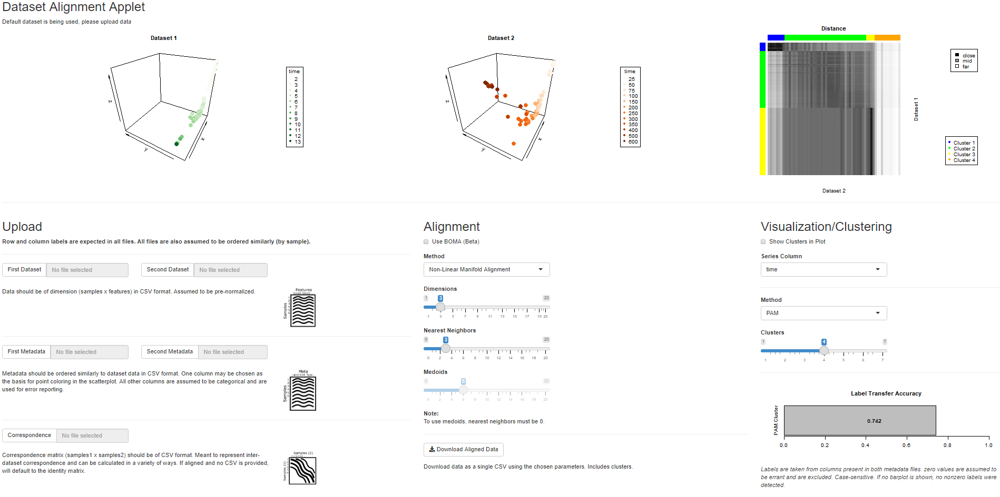

# ManiNetCluster Visualization

`app.R` is an R Shiny application to visualize aligned datasets.  Multiple tunable alignment and visualization parameters are present along with a live 3D view.  Implements [BOMA](https://doi.org/10.1016/j.crmeth.2023.100409) for ease of calculation.

The app can be found [here](https://daifengwanglab.shinyapps.io/boma_webapp/).

## Notice
- Image links will be broken if run in the R console.  It is recommended to instead run via the `Run App` button if using RStudio.

