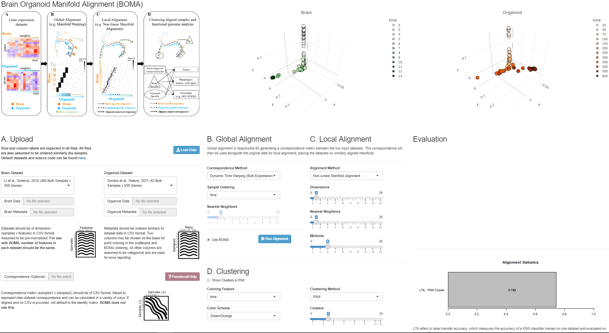

# ManiNetCluster Visualization

`app.R` is an R Shiny application to visualize aligned datasets.  Multiple tunable alignment and visualization parameters are present along with a live 3D view.

## Notice
- Image links will be broken if run in the R console.  It is recommended to instead run via the `Run App` button if using RStudio.
- The sample data has not been uploaded to GitHub, so the default data loading will return an error.  This is normal.

## Known Issues
- Sample data does not work with medoid calculation.
- If uploading datasets first, the applet may appear to be stuck on 'calculating'.  Clicking anywhere on the page should resolve this.
